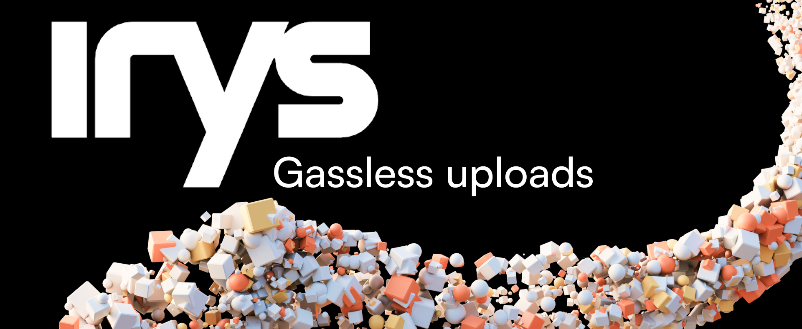

This is an example repository showing how to do gassless uploads to Arweave using Irys with a technique called server-side signing. There is code for using EVM and Solana wallets.

This project is a fork of the [Irys Provenance Toolkit](https://github.com/Irys-xyz/provenance-toolkit)

## Installation

1. Clone this repository
2. `cd gassless-uploader`
3. Rename `.env.local.example` to `.env.local` and add EVM and SOL private keys
4. `npm install`
5. `npm run dev`

## How it works

A NextJS server route is setup with a public / private key pair.

The end-user uploads a file and then:

1. The client requests the server's public key
2. The client asks the server to sign the upload
3. The server signs the upload and returns it to the client
4. The client creates a Provider using the public key and the signed data
5. The client uses the Provider object to create a WebIrys object
6. The client uses the WebIrys object to upload the file

## Utility functions

-   getIrys.ts
-   gasslessFundAndUpload.ts

## Server routes

There are two sets of server routes, o

### For EVM-based wallets

    - `lazyFundEVM`: Is
    - `publicKeyEVM`:
    - `signDataEVM`:

### For SOL-based wallets:

    - `lazyFundEVM`:
    - `publicKeyEVM`:
    - `signDataEVM`:
