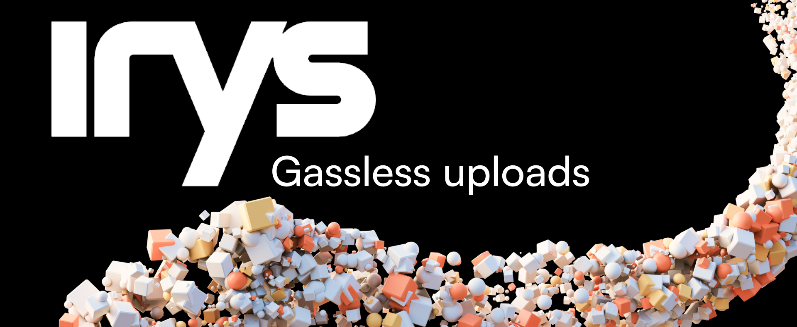

This is an example repository showing how to do gasless uploads to Arweave using Irys with a technique called server-side signing. There is code for using EVM and Solana wallets.

This project is a fork of the [Irys Provenance Toolkit](https://github.com/Irys-xyz/provenance-toolkit).

## Installation

1. Clone this repository
2. `cd gasless-uploader`
3. Rename `.env.local.example` to `.env.local` and add EVM and SOL private keys
4. `npm install`
5. `npm run dev`

## How it works

A NextJS server route is setup with a public / private key pair.

The end-user uploads a file and then:

1. The client requests the server's public key
2. The client asks the server to sign the upload
3. The server signs the upload and returns it to the client
4. The client creates a Provider using the public key and the signed data
5. The client uses the Provider object to create a WebIrys object
6. The client uses the WebIrys object to upload the file

## Utility functions

- `getIrys.ts`: Configures an Irys object using parameters in `.env.local`
- `gaslessFundAndUpload.ts`: When passed a File object, ensures the node has a sufficient to pay for the upload, creates a Provider object using the server's private key and finally uploads the file.

## Server routes

There are two sets of server routes, one for EVM chains and one for Solana.

### For EVM-based wallets

- `publicKeyEVM`: Returns the public key for the server's wallet. This is the first route called by the client.
- `lazyFundEVM`: Optional route used for lazy-funding uploads.
- `signDataEVM`: Signs the data provided using the server's private key.

### For SOL-based wallets:

- `publicKeySOL`: Returns the public key for the server's wallet. This is the first route called by the client.
- `lazyFundSOL`: Optional route used for lazy-funding uploads.
- `signDataSOL`: Signs the data provided using the server's private key.
